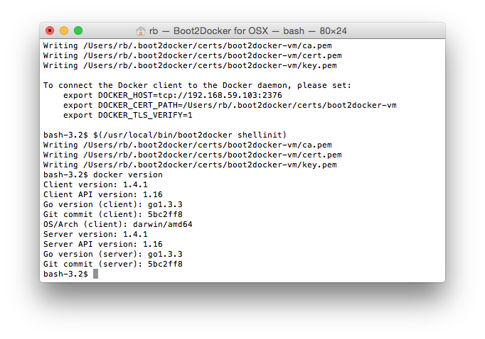
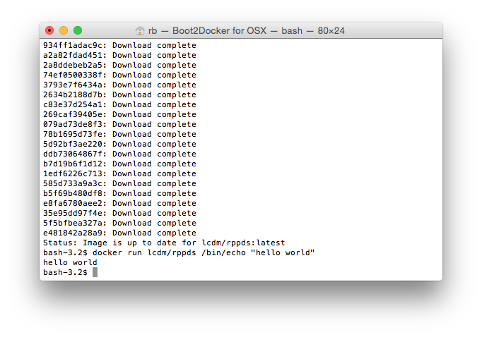

# Docker 

[Docker](http://www.docker.com) is an open lightweight virtualization technology that allows
users to build, distribute, and run applications. For the University of
Illinois, Research Park course _Practical Data Science_ we will use
the Docker platform to provide a homogenous programming platform to
simplify learning data science concepts. The Docker platform consists of
the Docker Engine, which is a portable and lightweight runtime, and the
Docker Hub, which provides an easy mechansism to share docker container
images.

To use Docker in this class you will need to complete two tasks:

1. Install the Docker Engine

2. Pull and install the docker container image for this course.

Note that in order to run the Docker engine, your computer must support
hardware virtualization.

-----

## How to Install the Docker Engine

The [official Docker documentation](https://docs.docker.com/) provides
clear [installation
guides](https://docs.docker.com/installation/#installation) for a
variety of platforms.
 
Since the Docker engine leverages Linux containerization, it requires
components from the Linux kernel. Thus, for a modern Linux operating
system, installation of the Docker engine is rather straightforward. To install
the Docker engine on Windows or Mac OSX, however, you first need to
install [Boot2Docker](http://boot2docker.io/), which provides the Linux
kernel functionality reqquired for the Docker engine. This functionaility is actually provided 
by installing the VirtualBox virtualization envirnment and a Linux guest operating system.

### Windows

Please see [Installing Docker on Windows](https://docs.docker.com/installation/windows/).

### Mac OS X

Please see [Installing Docker on Mac OSX](https://docs.docker.com/installation/mac/).

### Linux

If you are running Linux on your computer, you probably already know how
to install packages, but if you are not sure, look for your specific
Linux distribution in the [installation
section](https://docs.docker.com/installation/#installation) of the
Docker documentation.

-----

### Boot2Docker

If you are on a Windows or Mac OSX computer, you will have first
installed the Boot2Docker application. Once this application is
installed, run the `Boot2Docker` application that will open and
initialize a shell session in the VirtualBox virtual machine, note that
a Virtual Machine will be started if one is not already running. 

As an example, here is the Boot2Docker initiated shell script on Mac OSX:



-----

## The Practical Data Science Docker Container

The Docker container image for this course has Python 3 and a number of
Python libraries that we will use during the rest of this course already
pre-built. Once the Docker engine is installed, you can pull our course Docker
container from the Docker hub. This is accompished by issuing a `docker pull lcdm/rppds` command at the docker engine shell session. Thus on Windows or Mac OSX, this command is entered at the Boot2Docker shell session prompt. After a succesful download of a Docker container image, you will be presented with a suitable message along with the command prompt. To verify the container, you can run the Docker container.

```
$ docker run lcdm/info490 /bin/echo "hello world"
hello world
```
If you have been succesful, the `hello world` message will be displayed in your terminal window.



-----

## Docker Shared Folders

Although not required for this course, you can share folders between a Docker container and your normal, host operating system.  For a Mac OSX or Windows system, you will first need to [Enable Folder Sharing in Boot2Docker](https://github.com/boot2docker/boot2docker#folder-sharing)

For Linux systems, you can follow the general instructions for [setting up data volumes](https://docs.docker.com/userguide/dockervolumes/) in the Docker documentation.

-----
